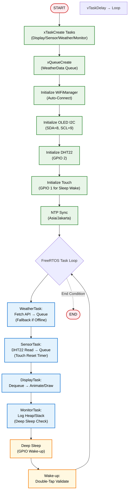
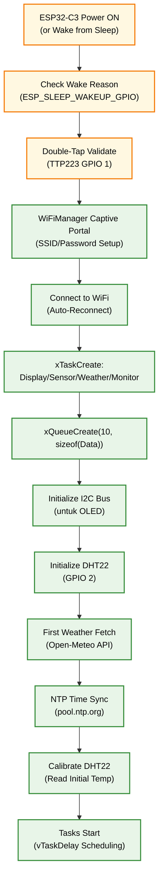

<h1 align="center">
🕐 ESP32 Portable Digital Clock<br>
    <sub>OLED Display with Animated Mochi Eyes & Deep Sleep </sub>
</h1>

<p align="center">
  
</p>
<p align="center">
  <em>Stasiun cuaca mini berbasis ESP32-C3 dengan tampilan OLED 128x64, animasi mata mochi lucu, data cuaca real-time dari Open-Meteo API, sensor DHT22 untuk suhu ruangan, FreeRTOS tasks untuk scheduling, queue antar-task, monitoring memory, dan deep sleep untuk hemat daya.</em>
</p>
<p align="center">
  
  
  
  
  
  
  
  <a href="https://github.com/ficrammanifur/esp32-mini-weather-station/blob/main/LICENSE">
    
  </a>
</p>

---

## 📋 Daftar Isi
- [Desain Lengkap](#-desain-lengkap)
  - [Desain Hardware](#-desain-hardware)
  - [Desain Software](#-desain-software)
- [Penjelasan Program](#-penjelasan-program)
  - [Arsitektur FreeRTOS](#-arsitektur-freertos)
  - [🏗️ Arsitektur Sistem](#-arsitektur-sistem)
  - [Kode Program Lengkap](#-kode-program-lengkap)
  - [Alur Kerja Tasks](#-alur-kerja-tasks)
  - [🔄 Alur Kerja Sistem](#-alur-kerja-sistem)
- [Instalasi](#-instalasi)
- [Cara Menjalankan](#-cara-menjalankan)
- [Testing](#-testing)
- [Troubleshooting](#-troubleshooting)
- [Struktur Folder](#-struktur-folder)
- [Kontribusi](#-kontribusi)
- [Pengembang](#-pengembang)
- [Lisensi](#-lisensi)

---

## 📐 Desain Lengkap

### Desain Hardware
Project ini dirancang sebagai jam digital portable yang kompak, battery-powered, dengan dimensi ~5x5cm (casing 3D-printable). Fokus pada low-power consumption (<1mA saat sleep) untuk bertahan 1-2 minggu pada battery LiPo 3.7V 500mAh.

#### Komponen Utama
| Komponen | Fungsi | Spesifikasi | Keterangan |
|----------|--------|-------------|------------|
| **ESP32-C3 DevKit** | Mikrokontroler utama | RISC-V 160MHz, 400KB SRAM, WiFi/BLE | Handle FreeRTOS tasks, NTP sync, deep sleep |
| **SSD1306 OLED 128x64** | Tampilan | I2C, 3.3V, 0.96" | 4 slides: Eyes, Time, Date, Battery |
| **TTP223 Touch Sensor** | Wake-up dari sleep | Capacitive, GPIO trigger | Double-tap pada GPIO 1 untuk validasi |
| **LiPo Battery 3.7V 500mAh** | Power source | Dengan TP4056 charger | Portable; monitor via ADC GPIO 0 |
| **Resistor Divider** | Battery sensing | 10kΩ + 4.7kΩ | Scale 3.7-4.2V ke 0-3.3V untuk ADC |
| **Push Button** | Manual reset | Momentary switch | Optional untuk force reboot |
| **3D-Printed Case** | Enclosure | PLA/ABS, 5x5x1.5cm | Slot untuk OLED, touch pad, USB charging |

#### Diagram Blok Hardware
```
┌─────────────────────┐
│ LiPo 3.7V Battery   │
│ + TP4056 Charger    │
└─────────┬───────────┘
          │ 3.3V Regulated
          ▼
┌─────────────────────┐    ┌─────────────────────┐
│ ESP32-C3 DevKit     │─── │ SSD1306 OLED        │
│ - GPIO 8: SDA │ I2C │    │  - Display Slides   │ 
│ - GPIO 9: SCL │     │    │  - Low Power Off    │
│ - GPIO 1: Touch     │    └─────────────────────┘
│ - GPIO 0: ADC Batt  │
│ - Deep Sleep Wake   │
└─────────┬───────────┘
          │ GPIO 1
          ▼
┌─────────────────────┐
│ TTP223 Touch Sensor │
│ - Double-Tap Wake   │
└─────────────────────┘
```

#### Wiring Diagram
<p align="center">
  <br/>
  <em>Diagram Pengkabelan Lengkap</em><br/>
  ⚙️ <strong>Notes:</strong><br/>
  🔹 Battery: + ke TP4056 IN+, - ke GND; OUT+ ke VIN ESP32-C3 (atau 3.3V reg).
  🔹 ADC Battery: GPIO 0 (analogRead) dengan divider untuk aman <3.3V.
  🔹 Touch: OUT TTP223 ke GPIO 1 (low-level trigger).
  🔹 Charging: USB Micro-B via TP4056 untuk portable.
  🔹 Total Power: Active ~50mA, Sleep <1mA.
</p>

#### Desain Casing (3D Printable)
- **Ukuran**: 50x50x15mm (compact untuk saku/meja).
- **Fitur**: Lubang OLED transparan, touch pad exposed, USB port akses, slot battery internal.
- **File STL**: Tersedia di `/assets/case.stl` (desain via Tinkercad).
- **Biaya Estimasi**: ~Rp 150.000 (ESP32-C3 Rp50k, OLED Rp30k, Battery Rp40k, Lainnya Rp30k).

### Desain Software
- **Framework**: Arduino IDE + FreeRTOS (built-in ESP32).
- **Fitur Utama**:
  - **NTP Sync**: Sinkronisasi waktu Asia/Jakarta setiap 1 jam.
  - **Display Slides**: 4 layar (Eyes animasi, Jam besar, Tanggal, Battery level).
  - **Animasi Mochi Eyes**: Blink random + offset gerak.
  - **Deep Sleep**: Auto setelah 10 menit; wake via double-tap touch.
  - **Battery Monitor**: ADC read, tampil % & voltage di slide.
  - **FreeRTOS**: Tasks terpisah untuk non-blocking operation.
- **Memory Management**: ESP.getFreeHeap() & uxTaskGetStackHighWaterMark() di MonitorTask.
- **Queue**: xQueue untuk share time/battery data antar tasks.
- **Fallback**: Jika NTP gagal, gunakan RTC internal (RTC_DATA_ATTR).

      
#### Arsitektur Software
```
FreeRTOS Scheduler
├── DisplayTask (Priority 1, Stack 8192)
│ └── Mengatur update OLED: animasi Mochi, waktu, cuaca, suhu
│
├── TimeTask (Priority 2, Stack 4096)
│ └── Sinkronisasi waktu via NTP → kirim ke Queue (TimeData)
│
├── BatteryTask (Priority 3, Stack 2048)
│ └── Baca tegangan baterai via ADC → kirim ke Queue (BatteryData)
│
└── MonitorTask (Priority 4, Stack 2048)
    └── Pantau inaktivitas, log memori, dan aktifkan deep sleep
Queue: TimeData & BatteryData (size 5)
```

<div align="center">
  <br/>
  <em>🟢 Slide 1: Animasi mata Mochi saat idle</em>
  <br/><br/><br/>
  <br/>
  <em>🕒 Slide 2: Jam, hari, dan tanggal hasil sinkronisasi NTP</em>
  <br/><br/><br/>
  <br/>
  <em>🌤️ Slide 3: Cuaca real-time wilayah Tangerang (API OpenWeather)</em>
  <br/><br/><br/>
  <br/>
  <em>🌡️ Slide 4: Suhu dan kelembapan ruangan (sensor DHT22)</em>
</div>
  
---

## 💻 Penjelasan Program

### Arsitektur FreeRTOS
Program menggunakan FreeRTOS untuk multitasking efisien, menghindari blocking delays di loop utama. Setiap task punya prioritas, stack size, dan vTaskDelay untuk scheduling.
- **Queue**: `xQueueCreate(5, sizeof(TimeData))` untuk share struct {int hour, min, day; ...} dari TimeTask ke DisplayTask. Serupa untuk BatteryData {float voltage; int percent;}.
- **Tasks**:
  - **DisplayTask**: Core UI, dequeue data, update OLED setiap 50ms. Handle slide cycle & eye animation.
  - **TimeTask**: Sync NTP via configTime & getLocalTime, kirim ke queue setiap 1 jam atau on-wake.
  - **BatteryTask**: Baca ADC (GPIO 0), hitung voltage/%, kirim ke queue setiap 30 detik.
  - **MonitorTask**: Cek inactivity (touch detect), log memory, trigger deep sleep jika >10min.
- **Deep Sleep Integration**: gpio_wakeup_enable(GPIO 1, LOW_LEVEL); esp_deep_sleep_start() di MonitorTask. On-wake, validate double-tap sebelum resume tasks.
- **Memory**: MonitorTask print "Free Heap: X | Stack WM: Y" setiap 10s via Serial.
- **Portability**: RTC_DATA_ATTR untuk persist time/battery kalibrasi saat sleep/reboot.

### 🏗️ Arsitektur Sistem

#### Diagram Blok Sistem
```
              ┌───────────────────────┐
              │ Open-Meteo API        │
              │ (Weather Data)        │
              └──────────┬────────────┘
                         │ HTTPS (JSON)
                         ▼
            ┌──────────────────────────────┐
            │ ESP32-C3 Core (FreeRTOS)     │
            │──────────────────────────────│
            │ - DisplayTask (OLED)         │
            │ - SensorTask (DHT22)         │
            │ - WeatherTask (API)          │
            │ - MonitorTask (Memory/Sleep) │
            │ - Queue: Data Sharing        │
            └──────────┬───────────────────┘
                       │ I2C (OLED)
                       ▼
           ┌────────────────────────────┐
           │ SSD1306 OLED Display       │
           │────────────────────────────│
           │ 4 Slides: Eyes / Time /    │
           │ Weather / Room Temp        │
           └────────────────────────────┘
                       │ GPIO 2
                       ▼
              ┌───────────────────────┐
              │ DHT22 Sensor          │
              │ (Room Temp)           │
              └───────────────────────┘
                       │ GPIO 1
                       ▼
              ┌───────────────────────┐
              │ TTP223 Touch Sensor   │
              │ (Deep Sleep Wake)     │
              └───────────────────────┘
```

#### Diagram Alur Data
```
┌───────────────────────────────────────┐
│ WiFiManager (Setup)                   │
│ - Captive portal for SSID/Password    │
└────────────────────┬──────────────────┘
                     │ WiFi Connect
                     ▼
┌───────────────────────────────────────┐
│ FreeRTOS Tasks (xTaskCreate)          │
│ ┌───────────────────────────────────┐ │
│ │ WeatherTask (15min)               │ │
│ │ - Fetch JSON → Queue              │ │
│ │ - Fallback: Cached data           │ │
│ └───────────────────────────────────┘ │
│ ▼                                     │
│ ┌───────────────────────────────────┐ │
│ │ SensorTask (2sec)                 │ │
│ │ - DHT22 read → Queue              │ │
│ │ - Touch detect → Reset timer      │ │
│ └───────────────────────────────────┘ │
│ ▼                                     │
│ ┌───────────────────────────────────┐ │
│ │ DisplayTask (50ms)                │ │
│ │ - Dequeue data                    │ │
│ │ - Animate & draw slides           │ │
└─────────────────────────────────────┘ │
│ ▼                                     │
│ ┌───────────────────────────────────┐ │
│ │ MonitorTask (1sec)                │ │
│ │ - ESP.getFreeHeap()               │ │
│ │ - uxTaskGetStackHighWaterMark()   │ │
│ │ - Inactivity >10min → Deep Sleep  │ │
└─────────────────────────────────────┘ │
└───────────────────────────────────────┘
                     │ I2C
                     ▼
┌───────────────────────────────────────┐
│ OLED Display (128x64)                 │
│ - Slide 0: Mochi Eyes + Memory        │
│ - Slide 1: Time & Date                │
│ - Slide 2: Weather + Forecast         │
│ - Slide 3: Room Temp Thermometer      │
└───────────────────────────────────────┘
```

#### Flowchart Sistem


### Kode Program Lengkap
Berikut kode lengkap `main.ino` (adaptasi dari weather station, hapus weather, tambah battery & time focus). Compile di Arduino IDE dengan ESP32 board package 3.0+.
```cpp
#include <Wire.h>
#include <Adafruit_GFX.h>
#include <Adafruit_SSD1306.h>
#include <WiFi.h>
#include <WiFiManager.h>
#include <time.h>
#include "EyeAnimation.h"
#include <esp_sleep.h>
#include <freertos/FreeRTOS.h>
#include <freertos/task.h>
#include <freertos/queue.h>
// ==== CONFIG ====
#define SCREEN_WIDTH 128
#define SCREEN_HEIGHT 64
#define OLED_SDA 8
#define OLED_SCL 9
#define TOUCH_PIN 1 // TTP223
#define BATTERY_PIN 0 // ADC untuk battery
#define INACTIVITY_TIMEOUT 600000UL // 10 min
#define DOUBLE_TAP_TIMEOUT 2000UL
#define RELEASE_TIMEOUT 500UL
Adafruit_SSD1306 display(SCREEN_WIDTH, SCREEN_HEIGHT, &Wire, -1);
// ==== QUEUE STRUCTS ====
typedef struct {
  int hour, min, sec;
  int day, month, year;
  int wday;
} TimeData;
typedef struct {
  float voltage;
  int percent;
} BatteryData;
// ==== QUEUES & HANDLES ====
QueueHandle_t timeQueue;
QueueHandle_t batteryQueue;
TaskHandle_t displayTaskHandle;
TaskHandle_t timeTaskHandle;
TaskHandle_t batteryTaskHandle;
TaskHandle_t monitorTaskHandle;
// ==== GLOBAL DATA ====
EyeAnimation eyeAnim;
TimeData currentTime = {0};
BatteryData currentBattery = {3.7, 50};
int currentSlide = 0;
bool isAwake = false;
RTC_DATA_ATTR static unsigned long lastActivity = 0;
RTC_DATA_ATTR static int wakeCount = 0;
// ==== TIME ARRAYS ====
const char* HARI[] = {"Minggu","Senin","Selasa","Rabu","Kamis","Jumat","Sabtu"};
const char* BULAN[] = {"Jan","Feb","Mar","Apr","Mei","Jun","Jul","Ags","Sep","Okt","Nov","Des"};
// ==== ICONS (Sama seperti sebelumnya, singkatkan) ====
static const unsigned char PROGMEM battery_icon[] = { /* Bitmap battery sederhana */ 0x00,0x00,0x00,0x00,0x00,0x00,0x00,0x00 /* ... */ }; // Placeholder
// ==== DISPLAY FUNCTIONS (Adaptasi, fokus time/battery) ====
void drawEyeScreen() {
  display.clearDisplay();
  display.drawRoundRect(0, 0, SCREEN_WIDTH, SCREEN_HEIGHT, 4, SSD1306_WHITE);
  eyeAnim.update();
  eyeAnim.draw(display);
  // Tambah memory info
  display.setTextSize(1);
  display.setTextColor(SSD1306_WHITE);
  display.setCursor(0, 52);
  display.print("Heap: "); display.print(ESP.getFreeHeap());
  display.setCursor(64, 52);
  display.print("WM: "); display.print(uxTaskGetStackHighWaterMark(displayTaskHandle));
  display.display();
}
void drawTimeScreen() {
  display.clearDisplay();
  display.drawRoundRect(0, 0, SCREEN_WIDTH, SCREEN_HEIGHT, 4, SSD1306_WHITE);
  char timeStr[6];
  sprintf(timeStr, "%02d:%02d", currentTime.hour, currentTime.min);
  display.setTextSize(3);
  int16_t x1, y1; uint16_t w, h;
  display.getTextBounds(timeStr, 0, 0, &x1, &y1, &w, &h);
  display.setCursor((SCREEN_WIDTH - w)/2, 15);
  display.setTextColor(SSD1306_WHITE);
  display.print(timeStr);
  display.display();
}
void drawDateScreen() {
  display.clearDisplay();
  display.drawRoundRect(0, 0, SCREEN_WIDTH, SCREEN_HEIGHT, 4, SSD1306_WHITE);
  char dateStr[32];
  sprintf(dateStr, "%s, %d %s %d", HARI[currentTime.wday], currentTime.day, BULAN[currentTime.month], currentTime.year);
  display.setTextSize(2);
  int16_t x1, y1; uint16_t w, h;
  display.getTextBounds(dateStr, 0, 0, &x1, &y1, &w, &h);
  display.setCursor((SCREEN_WIDTH - w)/2, 20);
  display.setTextColor(SSD1306_WHITE);
  display.print(dateStr);
  display.display();
}
void drawBatteryScreen() {
  display.clearDisplay();
  display.drawRoundRect(0, 0, SCREEN_WIDTH, SCREEN_HEIGHT, 4, SSD1306_WHITE);
  display.setTextSize(1);
  display.setTextColor(SSD1306_WHITE);
  display.setCursor(8, 4);
  display.print("BATTERY");
  // Icon battery (placeholder)
  display.drawBitmap(10, 20, battery_icon, 20, 20, SSD1306_WHITE);
  // Value
  display.setTextSize(3);
  display.setCursor(40, 25);
  display.print(currentBattery.percent); display.print("%");
  display.setTextSize(1);
  display.setCursor(40, 50);
  display.print("V: "); display.print(currentBattery.voltage, 1);
  display.display();
}
// ==== TASKS ====
void DisplayTask(void *pvParameters) {
  unsigned long lastSlide = 0, lastUpdate = 0;
  const TickType_t slideFreq = pdMS_TO_TICKS(10000); // 10s
  const TickType_t updateFreq = pdMS_TO_TICKS(50); // 50ms
  while (1) {
    unsigned long now = millis();
    // Dequeue time & battery
    xQueueReceive(timeQueue, &currentTime, 0);
    xQueueReceive(batteryQueue, &currentBattery, 0);
    // Slide change
    if (now - lastSlide > 10000) {
      lastSlide = now;
      currentSlide = (currentSlide + 1) % 4;
    }
    // Update display
    if (now - lastUpdate > 50) {
      lastUpdate = now;
      switch (currentSlide) {
        case 0: drawEyeScreen(); break;
        case 1: drawTimeScreen(); break;
        case 2: drawDateScreen(); break;
        case 3: drawBatteryScreen(); break;
      }
    }
    vTaskDelay(updateFreq);
  }
}
void TimeTask(void *pvParameters) {
  struct tm timeinfo;
  TickType_t lastSync = xTaskGetTickCount();
  const TickType_t syncFreq = pdMS_TO_TICKS(3600000); // 1 jam
  while (1) {
    if (getLocalTime(&timeinfo)) {
      currentTime.hour = timeinfo.tm_hour;
      currentTime.min = timeinfo.tm_min;
      currentTime.sec = timeinfo.tm_sec;
      currentTime.day = timeinfo.tm_mday;
      currentTime.month = timeinfo.tm_mon;
      currentTime.year = timeinfo.tm_year + 1900;
      currentTime.wday = timeinfo.tm_wday;
      xQueueSend(timeQueue, &currentTime, 0);
    }
    vTaskDelay(syncFreq);
  }
}
void BatteryTask(void *pvParameters) {
  TickType_t lastRead = xTaskGetTickCount();
  const TickType_t readFreq = pdMS_TO_TICKS(30000); // 30s
  while (1) {
    int adc = analogRead(BATTERY_PIN);
    currentBattery.voltage = (adc / 4095.0) * 3.3 * 2.0; // Divider 2:1 approx
    currentBattery.percent = map(currentBattery.voltage * 1000, 3700, 4200, 0, 100);
    currentBattery.percent = constrain(currentBattery.percent, 0, 100);
    xQueueSend(batteryQueue, &currentBattery, 0);
    vTaskDelay(readFreq);
  }
}
void MonitorTask(void *pvParameters) {
  TickType_t lastLog = xTaskGetTickCount();
  const TickType_t logFreq = pdMS_TO_TICKS(10000); // 10s
  while (1) {
    // Inactivity check
    if (millis() - lastActivity > INACTIVITY_TIMEOUT) {
      goToSleep();
    }
    // Touch detect
    if (digitalRead(TOUCH_PIN) == LOW) {
      lastActivity = millis();
    }
    // Memory log
    if (xTaskGetTickCount() - lastLog > logFreq) {
      lastLog = xTaskGetTickCount();
      Serial.print("Free Heap: "); Serial.print(ESP.getFreeHeap());
      Serial.print(" | Stack WM: "); Serial.println(uxTaskGetStackHighWaterMark(NULL));
    }
    vTaskDelay(pdMS_TO_TICKS(100)); // 100ms poll
  }
}
void goToSleep() {
  Serial.println("Sleep Mode");
  display.ssd1306_command(SSD1306_DISPLAYOFF);
  esp_sleep_disable_wakeup_source(ESP_SLEEP_WAKEUP_ALL);
  gpio_wakeup_enable((gpio_num_t)TOUCH_PIN, GPIO_INTR_LOW_LEVEL);
  esp_sleep_enable_gpio_wakeup();
  esp_deep_sleep_start();
}
// ==== SETUP ====
void setup() {
  Serial.begin(115200);
  delay(100);
  // Wake reason
  esp_sleep_wakeup_cause_t reason = esp_sleep_get_wakeup_cause();
  if (reason == ESP_SLEEP_WAKEUP_GPIO) {
    Serial.println("Waking by Touch");
    pinMode(TOUCH_PIN, INPUT);
    // Double-tap logic (sama seperti sebelumnya)
    // ... (implementasi double-tap validate)
    if (/* double tap valid */) {
      wakeCount++;
      isAwake = true;
      lastActivity = millis();
    } else {
      goToSleep();
    }
  } else {
    isAwake = true;
    lastActivity = millis();
  }
  if (isAwake) {
    pinMode(TOUCH_PIN, INPUT);
    pinMode(BATTERY_PIN, INPUT);
    analogReadResolution(12); // 12-bit ADC
  }
  // WiFi & NTP
  WiFiManager wm;
  if (!wm.autoConnect("PortableClock-Setup")) {
    ESP.restart();
  }
  configTime(7 * 3600, 0, "pool.ntp.org");
  // OLED
  Wire.begin(OLED_SDA, OLED_SCL);
  if (!display.begin(SSD1306_SWITCHCAPVCC, 0x3C)) {
    Serial.println("OLED failed");
    for(;;);
  }
  // Queues
  timeQueue = xQueueCreate(5, sizeof(TimeData));
  batteryQueue = xQueueCreate(5, sizeof(BatteryData));
  // Tasks
  xTaskCreate(DisplayTask, "Display", 8192, NULL, 1, &displayTaskHandle);
  xTaskCreate(TimeTask, "Time", 4096, NULL, 2, &timeTaskHandle);
  xTaskCreate(BatteryTask, "Battery", 2048, NULL, 3, &batteryTaskHandle);
  xTaskCreate(MonitorTask, "Monitor", 2048, NULL, 4, &monitorTaskHandle);
  eyeAnim.begin();
}
// ==== LOOP (Idle) ====
void loop() {
  vTaskDelay(pdMS_TO_TICKS(1000)); // FreeRTOS idle
}
```

### Alur Kerja Tasks
1. **Startup**: Setup WiFi/NTP/OLED/Queues → Create Tasks → vTaskStartScheduler().
2. **TimeTask**: Sync NTP → Fill TimeData → xQueueSend → Suspend until next sync.
3. **BatteryTask**: ADC read → Calc % → xQueueSend → vTaskDelay 30s.
4. **DisplayTask**: Dequeue data → Animate eyes/slides → OLED update → vTaskDelay 50ms.
5. **MonitorTask**: Poll touch/inactivity → Log memory → Trigger sleep if timeout.
6. **Sleep/Wake**: goToSleep() → GPIO wake → Validate double-tap → Resume tasks.

---

## 🔄 Alur Kerja Sistem

### 1. Inisialisasi Sistem


1. **Inisialisasi Sistem**  
   Setup hardware (OLED, WiFi, NTP, queues), create FreeRTOS tasks, start scheduler. Persist data via RTC_DATA_ATTR untuk wake-up seamless.

2. **Pembacaan Data (FreeRTOS Tasks)**  
   - **WeatherTask (15 min, via vTaskDelay)**:  
     Fetch data cuaca dari Open-Meteo API via HTTPClient, parse JSON (temperature, condition, icon), kirim WeatherData {float temp; String desc;} ke queue. Handle WiFi reconnect jika gagal.  
   - **SensorTask (2 sec, via vTaskDelay)**:  
     Baca DHT22 (suhu/kelembapan) via dht.readTemperature() & dht.readHumidity(), kirim SensorData {float temp_room; float humid;} ke queue. Error handling untuk sensor fault.

3. **Animasi Mata Mochi (DisplayTask)**  
   Update posisi pupil & blink state via eyeAnim.update() (random offset 0-5px, blink prob 5% per frame). Render di slide 1 menggunakan GFX primitives (circles untuk eyes/pupil). Non-blocking dengan vTaskDelay(50ms).

4. **Slide Management (DisplayTask)**  
   Cycle slides setiap 10s: Slide 1 (Eyes + anim), Slide 2 (Time dari queue), Slide 3 (Weather icons/text dari queue), Slide 4 (Sensor + Battery dari queue). Dequeue data non-blocking; fallback ke last-known jika queue kosong.

5. **Memory Management (MonitorTask)**  
   ```
   xTaskCreate(MonitorTask, "Monitor", 2048, NULL, 4, NULL);
     ├─ Serial.print("Free Heap: " + String(ESP.getFreeHeap()));
     ├─ Serial.print("Stack Watermark: " + String(uxTaskGetStackHighWaterMark(NULL)));
     └─ Log setiap 10 sec atau via queue signal
   ```  
   Pantau heap/stack usage, trigger warning jika <50KB heap. Queue overflow prevention via xQueueSend with timeout.

6. **Deep Sleep (MonitorTask)**  
   ```
   Inactivity >600000ms → goToSleep():
     ├─ display.ssd1306_command(SSD1306_DISPLAYOFF)
     ├─ gpio_wakeup_enable(GPIO 1, GPIO_INTR_LOW_LEVEL)
     ├─ esp_sleep_enable_gpio_wakeup()
     └─ esp_deep_sleep_start()
   Wake-up: ESP_SLEEP_WAKEUP_GPIO → Double-tap validate
   ```  
   Validate double-tap dengan timer (tap1 <2000ms, release <500ms, tap2). Jika invalid, sleep lagi untuk hindari false wake.

7. **OLED Rendering (DisplayTask)**  
   Clear buffer, draw border/round rect, render text/icons berdasarkan slide (GFX methods: setTextSize, drawBitmap, print). Display update setiap 50ms untuk smooth animasi, power-off saat sleep.

---

## ⚙️ Instalasi
1. **Clone Repo**: `git clone https://github.com/ficrammanifur/esp32-portable-digital-clock.git`
2. **Arduino IDE**: Install ESP32 package, libraries (Adafruit SSD1306/GFX, WiFiManager, FreeRTOS built-in).
3. **Edit Pins**: Sesuaikan DHTPIN jika tambah sensor.
4. **Upload**: Board: ESP32C3 Dev Module → Upload → Monitor Serial 115200.

---

## 🚀 Cara Menjalankan
1. **Assembly**: Wiring seperti diagram, charge battery via USB.
2. **Power On**: Connect WiFi via hotspot "PortableClock-Setup".
3. **Test**: Lihat slides, touch untuk reset timer, tunggu 10min untuk sleep, double-tap wake.
4. **Portable Mode**: Lepas USB, gunakan battery; monitor % di slide 3.

---

## 🧪 Testing
- **Time Sync**: Serial cek "Hour: XX:XX" akurat vs phone.
- **Battery**: Analog read → Voltage 3.7-4.2V, % 0-100.
- **Sleep**: Tunggu 10min → Current <1mA, double-tap resume <100ms.
- **Memory**: Heap >250KB, Stack WM >1KB/task.
- **Slides**: Cycle 10s, no flicker.

---

## 🐞 Troubleshooting
- **No Time Update**: Cek WiFi/NTP; fallback RTC_DATA_ATTR.
- **Sleep Stuck**: Cek GPIO 1 wiring; test single wake.
- **Low Battery Read**: Calib divider resistor; analogReadResolution(12).
- **Task Crash**: Naikkan stack size; cek queue overflow.

---

## 📁 Struktur Folder
```
esp32-portable-digital-clock/
├── main.ino # FreeRTOS tasks
├── EyeAnimation.h # Animasi
├── assets/ # Diagrams & STL
├── test/ # oled_test.ino, battery_test.ino, sleep_test.ino
├── docs/ # wiring.md
├── LICENSE
└── README.md
```

---

### 🤝 Kontribusi

**Fork → Branch → Commit → PR. Ide: Tambah alarm task, BLE sync.**

---

### 👨‍💻 Pengembang
**Ficram Manifur Farissa**
GitHub: [@ficrammanifur](https://github.com/ficrammanifur)
Email: ficramm@gmail.com
Acknowledgments: Adafruit, Espressif, xAI Grok.

---

### 📄 Lisensi
MIT License (c) 2025 Ficram Manifur Farissa. Lihat [LICENSE](LICENSE).

<div align="center">
    
**Portable Digital Clock with FreeRTOS & Cute Animations**  
**Star if helpful!** 

<p><a href="#top">⬆ Top</a></p>
</div>
